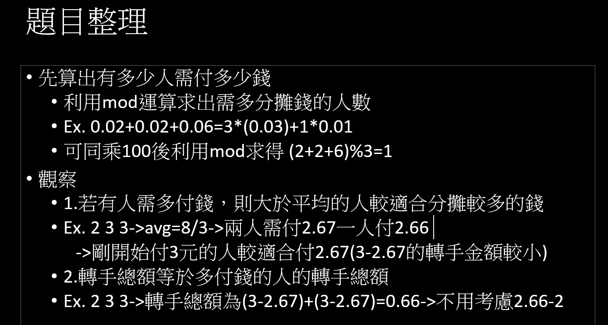

# Week 1

## 459 Graph Connectivity

(DSU並查集)

給你幾個點及幾個邊，問你建邊後，有幾個連通塊存在。

### 想法

用並查集

## 10196 check the check

(模擬)

題目給你六種旗子的走法，給你一個8*8棋盤，大小寫的棋子分別代表黑跟白的棋子，要你判斷說在現在棋盤的情況下，黑跟白的king有沒有被吃掉的風險。

輸入直到讀到一個空白棋盤停止。

### 想法

1. 遍歷每個旗子，看是否會傷害到對方的king。
2. 直接檢查兩個king，尋找能攻擊到king的棋子。

   想法沒什麼難的，就是實作難，要打很長的code，懶得打。

## 10267 Graphical Editor

### 想法

## 10137 The Trip

一群小屁孩出去玩，旅行途中，各自付了不同的錢，最後大家想要平分支出，問需要被轉手的最小金額，金額最小單位為0.01。

### 想法

## 10324 Zeros and Ones

輸入一個字串由0及1組成，接著再輸入多筆範圍，判斷該範圍是否同為1或同為0。

### 想法

前綴和

[三種作法-前綴和/分組/線段樹
](https://hackmd.io/@sa072686/rkzaZ4EOm/https%3A%2F%2Fhackmd.io%2Fs%2FBk_fBt-Om?type=book#UVA-10324)
